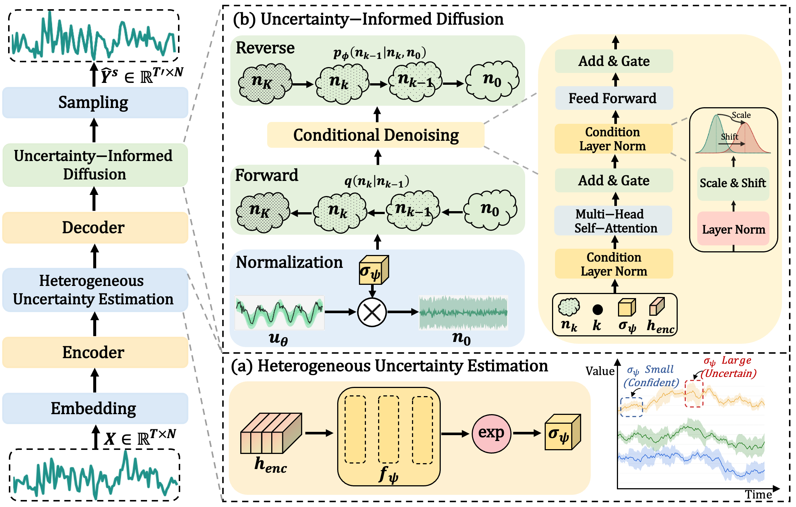

# ✨ HUDiff 

The repo is the official implementation for the paper: Heterogeneous Uncertainty-Informed Diffusion for Probabilistic Time Series Forecasting

## Overview

<p align="center">    </p>

## Requirements

```bash
pip install -r requirements.txt
```

## Datasets

The datasets can be download from [Google Drive](https://drive.google.com/file/d/1l51QsKvQPcqILT3DwfjCgx8Dsg2rpjot/view?usp=drive_link) or [Baidu Cloud](https://pan.baidu.com/s/11AWXg1Z6UwjHzmto4hesAA?pwd=9qjr).


## Acknowledgements

We are very grateful to all the reviewers for taking the time to help us review the paper！


